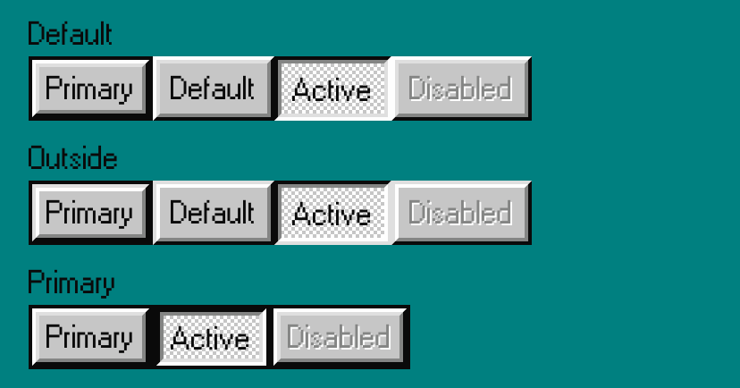

Use buttons to trigger an action after a user interaction.



### Usage

```javascript
import { Button } from 'react95-native';

<Button variant='default' onPress={() => console.warn('onPress')} primary>
  Primary
</Button>;
```

### Props

_(all props are optional)_

**`accessibilityLabel`**: `string`

**`active`**: `boolean`

**`children`**: `React.ReactNode`

**`disabled`**: `boolean`

**`onPress`**: `() => void`

**`onLongPress`**: `() => void`

**`primary`**: `boolean`

**`size`**: `Sizes`

**`square`**: `boolean`

**`style`**: `StyleProp<ViewStyle>`

**`variant`**: `ButtonVariants`
